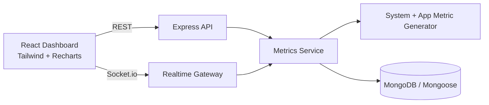

# DevPulse

DevPulse is a production-style full-stack monitoring dashboard for developers. It combines host-level telemetry, simulated application metrics, historical persistence, and live websocket streams into a dark real-time UI.

## Project Overview

### What DevPulse monitors

- System metrics: CPU usage, memory usage, uptime, load average, process memory.
- Application metrics: request latency, request rate, error rate.
- Infrastructure metrics: socket client count and MongoDB connection state.
- Bonus: simulated multi-server cluster cards and alert center.

### Tech stack

Frontend:

- React + Vite
- TailwindCSS
- Recharts
- Axios
- Socket.io-client

Backend:

- Node.js (ES modules)
- Express
- Socket.io
- MongoDB via Mongoose
- dotenv

## Architecture

### High-level diagram



### Backend module design

- `config`: environment-driven database bootstrap.
- `controllers`: request/response handlers.
- `routes`: API endpoint declarations.
- `services`: metric generation, caching, persistence, event broadcasting.
- `sockets`: websocket event registration.
- `utils`: metric generation and helpers.

## Project Structure

```text
.
├── backend
│   ├── .env.example
│   ├── package.json
│   └── src
│       ├── app.js
│       ├── server.js
│       ├── config
│       │   └── db.js
│       ├── controllers
│       │   └── metricsController.js
│       ├── models
│       │   └── MetricSnapshot.js
│       ├── routes
│       │   └── metricsRoutes.js
│       ├── services
│       │   └── metricsService.js
│       ├── sockets
│       │   └── metricsSocket.js
│       └── utils
│           └── metricGenerator.js
├── frontend
│   ├── .env.example
│   ├── package.json
│   ├── postcss.config.js
│   ├── tailwind.config.js
│   └── src
│       ├── App.jsx
│       ├── index.css
│       ├── main.jsx
│       ├── components
│       │   ├── Dashboard.jsx
│       │   ├── MetricCard.jsx
│       │   ├── MetricsChart.jsx
│       │   ├── Navbar.jsx
│       │   └── SystemStatus.jsx
│       ├── pages
│       │   └── Home.jsx
│       └── services
│           ├── api.js
│           └── socket.js
├── package.json
└── README.md
```

## API Endpoints

- `GET /api/metrics/current`: latest snapshot of system + app + infra metrics.
- `GET /api/metrics/history?limit=60`: historical metric snapshots.
- `GET /api/status`: API health and runtime status.

## Realtime Events

- `metrics:seed`: initial payload after socket connect.
- `metrics:update`: emitted every 2 seconds.
- `metrics:refresh`: client-triggered refresh request.

## Docker Setup (Recommended)

DevPulse includes Docker support for easy deployment and development.

### Prerequisites
- Docker Engine 20.10+
- Docker Compose 2.0+

### Quick Start with Docker

1. **Clone the repository:**
```bash
git clone https://github.com/Maheshwarikponnan/dev-pulse.git
cd dev-pulse
```

2. **Start all services:**
```bash
docker-compose up -d
```

3. **Access the application:**
- Frontend: http://localhost
- Backend API: http://localhost:3001
- MongoDB: localhost:27017

4. **View logs:**
```bash
docker-compose logs -f
```

5. **Stop services:**
```bash
docker-compose down
```

### Docker Services

- **frontend**: React dashboard served by Nginx
- **backend**: Node.js API with Socket.io
- **mongodb**: MongoDB database with authentication

### Development with Docker

For development with hot reloading:

```bash
# Run only backend and database
docker-compose up -d mongodb backend

# Run frontend locally
cd frontend && npm run dev
```

### Production Deployment

The Docker setup is production-ready with:
- Multi-stage builds for optimized images
- Health checks for all services
- Proper security configurations
- Nginx for static file serving

## Setup Instructions

### 1) Install dependencies

```bash
npm install
npm install --prefix backend
npm install --prefix frontend
```

### 2) Environment setup

Backend:

```bash
cp backend/.env.example backend/.env
```

Frontend (optional overrides):

```bash
cp frontend/.env.example frontend/.env
```

### 3) MongoDB setup

Local MongoDB (default URI in `.env.example`):

```bash
mongod --dbpath ~/data/db
```

Or Docker:

```bash
docker run -d --name devpulse-mongo -p 27017:27017 mongo:7
```

If MongoDB is unavailable, DevPulse still runs in degraded mode with in-memory history.

### 4) Run the application

Run frontend + backend together:

```bash
npm run dev
```

Or run each service separately:

```bash
npm run server
npm run client
```

### 5) Build frontend

```bash
npm run build
```

## Future Improvements

- Auth + role-based dashboards for teams.
- Alert delivery via Slack, email, or PagerDuty.
- Per-service metric grouping and custom dashboards.
- P95/P99 latency histograms and anomaly detection.
- Deployment presets for Kubernetes and cloud environments.
